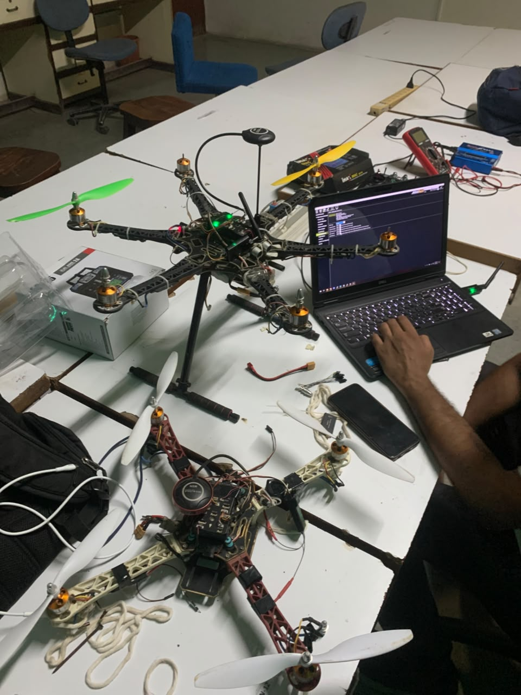

# Pixhawk F450 Quadcopter & F550 Hexacopter Guide
### <center>By M.Anas Baig (23ES020), Usman Zubair (22ES025), Daniyal Arain (22ES071) & Prof. Abbas Shah Syed</center>

This repository contains comprehensive technical documentation, assembly manuals, pre-flight checklists, and troubleshooting logs for building and configuring **F450 (Quadcopter)** and **F550 (Hexacopter)** drones using the **Pixhawk 2.4.8** flight controller and **Mission Planner** Ground Control Station (GCS).

---

## 📂 Repository Structure

*   **[`f450_f550_assembly_and_precheck_guide.md`](./f450_f550_assembly_and_precheck_guide.md)**: A step-by-step master assembly manual covering PDB soldering, structural frame assembly, hardware wiring layout configurations (Quad-X vs. Hexa-X), and bench calibration routines.
*   **[`drone_issues_and_solutions_log.md`](./drone_issues_and_solutions_log.md)**: A detailed diagnostic log documenting critical parameter overrides, battery failsafe benchmarks, transmitter channel mapping, and software fixes for known glitches encountered during bench testing.





---

## 🛠️ Hardware Specification Matrix

| Component | Specification |
| :--- | :--- |
| **Flight Controller** | Pixhawk 2.4.8 (Firmware: Pixhawk 1) |
| **Ground Control Software** | Mission Planner / QGroundControl |
| **Supported Frames** | F450 (Quad-X) & F550 (Hexa-X) |
| **Telemetry Kit** | YoungRC 915MHz 100MW RC Air and Ground Data Modules |
| **GPS & Compass** | Readytosky M10 GPS Module with External Compass (SPI External / I2C Internal) |
| **Power Plant** | Brushless DC Motors (e.g., A2212 1000kV) with 40A Brushless ESCs (5V/3A BEC) |
| **Battery Source** | LiPo 3S 11.1V 4200mAH (Supports up to 4S) |

---

## 🚀 Quick Reference Guide

### 🔋 Battery Safety Thresholds
*   **Critical Voltage Floor:** **`10.5 V`** 
*   **Failsafe Action:** Automatically triggers **Return-To-Launch (RTL)** along the predefined flight path.
*   **Key Parameters:** `BATT_CRT_VOLT` and `BATT_LOW_VOLT` in Mission Planner.

### 🎮 Transmitter Output Thresholds (RC3 - Throttle)
*   **Max PWM Value:** `1976`
*   **Motor Spin-Up Threshold:** `1400`
*   **Thrust Increase Zone:** `1600`
*   **Motor Deceleration Window:** `1300`

### 🔧 Critical Parameter Workarounds

If you experience flight controller initialization issues, use ArduPilot’s **Full Parameter List** to apply these specific configuration overrides:

```ini
# Fix for Dead Throttle / Signal routing failure
SERVO1_FUNCTION = 4       # Remaps Channel 1 to Aileron
SERVO3_FUNCTION = 70      # Remaps Channel 3 to Throttle

# Fix for Motors Not Starting Simultaneously 
# Increase value incrementally if motors lag during arming
MOT_SPIN_ARM = 0.15       # Raised from default 0.10 to jump-start ESCs

# Fix for PreArm: Baro: GPS alt error 5802m (Altitude Discrepancy)
# Rerun full GPS calibration, then modify the following:
BARO_ALTER_OPTIONS = 1    
BARO_OP = 0               # Overrides altitude data mismatch errors
# Note: Manually reboot the Pixhawk board immediately after saving.
```

---

## ⚠️ Safety Warning
> [!WARNING]
> **ALWAYS REMOVE PROPELLERS** during assembly, wiring modifications, receiver binding, firmware changes, and ESC/Motor calibrations. Only attach propellers (1045 or 9450 self-tightening caps, text facing **UP**) when the drone is fully calibrated, verified via the GCS status screen, and ready for outdoor field-testing.

---

## 🤝 Contributing
If you are testing variations of this hardware kit (such as alternative power modules or different ESC signaling rates), feel free to open a **Pull Request** or log structural updates in the issue tracker to expand the `drone_issues_and_solutions_log.md`.
